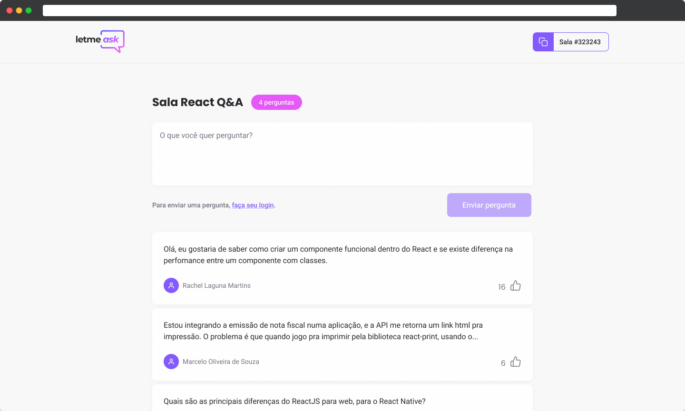

<div align="center" >
  
</div>

<h4 align="center">
  Web App created for Next Level Week Together to receive questions from viewers during a livestream, so host can control their questions.
</h4>

<div align="center">
  

</div>
<div align="center">
  
</div>

## Tecnologies

This project was developed using front-end technology and Firebase services.

- [ReactJS](https://reactjs.org/)
- [Typescript](https://www.typescriptlang.org/)
- [Firebase Authentication](https://firebase.google.com/products/auth)
- [Firebase Realtime Database](https://firebase.google.com/products/realtime-database)

## 💻 Getting started

### Requirements

- You need to install both [Node.js](https://nodejs.org/en/download/) and [Yarn](https://yarnpkg.com/) to run this project.

**Clone the project and access the folder**

```bash
$ git clone https://github.com/Samuca-sys/letmeask-nlw6.git && cd letmeask-nlw6
```

**Follow the steps below**

```bash
# Install the dependencies
$ yarn

# Change every API_KEY value using environment variable values from you Firebase project into env-example file
# Rename .env-example file to .env

# Start application
$ yarn start
```

The app will be available for access on your browser at `http://localhost:3000`

## ❗ Help

For more information, access [full guide](https://www.notion.so/LetMeAsk-817f5fc14eb3478a80c876b8c1e795c2).

## 📝 License

This project is licensed under the MIT License - see the [LICENSE](LICENSE) file for details.

---

Made with 💜 by Samuel Macedo 👋 [Check out my LinkedIn](https://www.linkedin.com/in/samuel-macedo)
